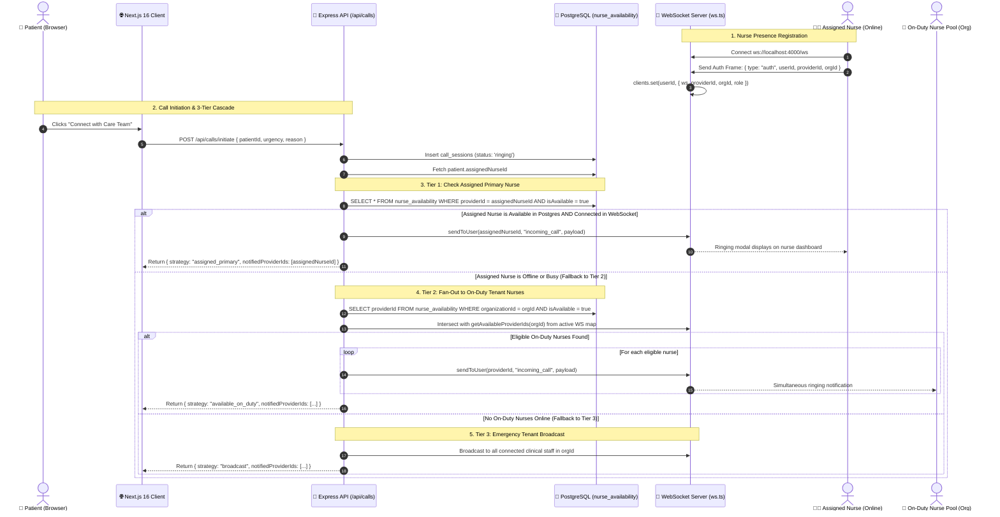
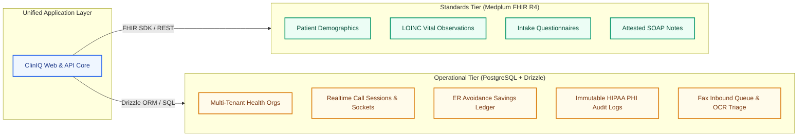
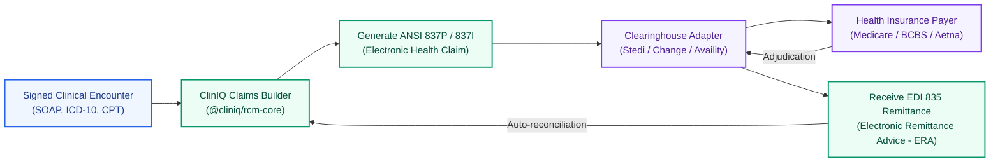

# Architecture FAQ, Deep-Dive & Extensibility Blueprint

This document serves as the executive and technical master guide for ClinIQ. It answers critical questions on **how real-time components interconnect**, why core design decisions were made, and provides a **plug-and-play adapter blueprint** for swapping or adding third-party AI, Speech, OCR, RCM, and Payment services.

---

## 📑 Quick Navigation
1. [Core Deep-Dive: 3-Tier Call Routing & Real-Time WebSockets](#1-core-deep-dive-3-tier-call-routing--real-time-websockets)
2. [Why Decoupled Overlay Architecture? (Postgres + Medplum FHIR)](#2-why-decoupled-overlay-architecture-postgres--medplum-fhir)
3. [Pluggable Adapter Pattern & Multi-Vendor Extensibility](#3-pluggable-adapter-pattern--multi-vendor-extensibility)
   - [A. Speech-to-Text (STT) Engines (Deepgram, Whisper, AWS Transcribe)](#a-speech-to-text-stt-engines)
   - [B. Clinical AI & LLMs (Claude 3.5, OpenAI GPT-4o, Google Gemini)](#b-clinical-ai--llms)
   - [C. Document Parsing & OCR (Claude Vision, LlamaParse, AWS Textract)](#c-document-parsing--ocr)
   - [D. Revenue Cycle Management (RCM) & EDI 837/835 Claims Clearinghouses](#d-revenue-cycle-management-rcm--edi-837835-clearinghouses)
   - [E. Payment & Billing Gateways (Stripe Health, Patient Portals)](#e-payment--billing-gateways)
4. [Enterprise Cost Optimization & Vendor Lock-In Defense](#4-enterprise-cost-optimization--vendor-lock-in-defense)
5. [Executive Summary for Leadership & Reviewers](#5-executive-summary-for-leadership--reviewers)

---

## 1. Core Deep-Dive: 3-Tier Call Routing & Real-Time WebSockets

### Question:
> **How does 3-tier nurse call routing (`callRouting.ts`) link real-time WebSockets to PostgreSQL `nurse_availability`?**

### Detailed Architectural Answer:
ClinIQ connects persistent relational records in PostgreSQL (`packages/db`) with ephemeral in-memory WebSocket connections in Node.js (`apps/api-server`) through a high-speed intersection algorithm in `src/lib/callRouting.ts`.



### Technical Mechanism (Step-by-Step):

1. **In-Memory Connection Map (`apps/api-server/src/lib/ws.ts`)**:
   When clinicians log into the web workspace, their browser opens a persistent WebSocket connection to `/ws` and authenticates:
   ```typescript
   // Map of active, connected WebSockets indexed by userId
   const clients = new Map<string, ConnectedClient>();
   
   // Storing active socket metadata
   clients.set(message.userId, {
     userId: message.userId,
     role: message.role,
     organizationId: message.organizationId,
     providerId: message.providerId,
     ws,
   });
   ```

2. **Relational Duty Status (`packages/db/src/schema/index.ts`)**:
   The PostgreSQL `nurse_availability` table acts as the authoritative record of scheduled on-duty status, current concurrent call counts, and max capacity:
   ```sql
   CREATE TABLE nurse_availability (
     id UUID PRIMARY KEY,
     provider_id UUID NOT NULL REFERENCES providers(id),
     organization_id UUID NOT NULL REFERENCES organizations(id),
     is_available BOOLEAN DEFAULT false,
     status TEXT DEFAULT 'offline', -- 'available' | 'busy' | 'offline'
     max_concurrent_calls INTEGER DEFAULT 1,
     current_call_count INTEGER DEFAULT 0,
     last_heartbeat TIMESTAMP DEFAULT NOW()
   );
   ```

3. **Smart Intersection in `callRouting.ts`**:
   The routing engine queries both layers simultaneously:
   - **PostgreSQL** ensures only clinicians marked as `isAvailable: true` and `status: 'available'` within the tenant organization are candidates.
   - **`getAvailableProviderIds(organizationId)`** inspects the live WebSocket map to ensure the clinician's browser tab is actively connected and ready to receive WebRTC signals (`ws.readyState === WebSocket.OPEN`).
   - The intersection `eligibleIds = availableNurses.filter(n => activeProviderIds.includes(n.providerId))` guarantees zero phantom calls to disconnected sessions.

---

## 2. Why Decoupled Overlay Architecture? (Postgres + Medplum FHIR)



### Key Architectural Rationale:
* **HL7 FHIR R4 Compliance without Performance Penalties**: Standard FHIR JSON schemas are ideal for medical records and interoperability, but suboptimal for sub-millisecond call routing, real-time presence heartbeats, and transactional financial accounting.
* **Zero Forking of Upstream Medplum**: Because Medplum is treated as a clean, off-the-shelf library, updates to `@medplum/core` can be applied without merge conflicts.
* **Multi-Tenant Scoping**: B2B employer ledgers and HIPAA access audits reside in indexed relational tables with foreign keys and foreign constraints.

---

## 3. Pluggable Adapter Pattern & Multi-Vendor Extensibility

ClinIQ utilizes the **Dependency Inversion / Adapter Pattern** for all external intelligence and communication services. Business logic interacts exclusively with abstract TypeScript interfaces defined in `@cliniq/api-spec` or `apps/api-server/src/lib/`.

```mermaid
flowchart TB
    %% --- STYLES & COLOR CLASSES ---
    classDef coreStyle fill:#eff6ff,stroke:#2563eb,stroke-width:2px,color:#1e3a8a,font-weight:bold;
    classDef adapterStyle fill:#f5f3ff,stroke:#7c3aed,stroke-width:2px,color:#4c1d95,font-weight:bold;
    classDef currentStyle fill:#ecfdf5,stroke:#059669,stroke-width:2px,color:#064e3b,font-weight:bold;
    classDef futureStyle fill:#fffbeb,stroke:#d97706,stroke-width:2px,color:#78350f,stroke-dasharray: 5 5;

    subgraph CORE_SERVICES ["ClinIQ Core Domain Services"]
        SCRIBE_SVC["Scribe Service"]:::coreStyle
        FAX_SVC["Fax Pipeline"]:::coreStyle
        BILLING_SVC["Financial & RCM Service"]:::coreStyle
    end

    subgraph ADAPTERS ["Pluggable Adapter Interfaces"]
        STT_ADAPTER["SpeechToTextAdapter"]:::adapterStyle
        AI_ADAPTER["ClinicalAiAdapter"]:::adapterStyle
        OCR_ADAPTER["DocumentParserAdapter"]:::adapterStyle
        RCM_ADAPTER["ClaimsClearinghouseAdapter"]:::adapterStyle
        PAY_ADAPTER["PaymentGatewayAdapter"]:::adapterStyle
    end

    subgraph VENDORS_STT ["Speech-to-Text Providers"]
        DEEPGRAM_PROV["Deepgram Nova-2 (Current)"]:::currentStyle
        WHISPER_PROV["OpenAI Whisper / Realtime (Future)"]:::futureStyle
        AWS_STT_PROV["AWS Transcribe Medical (Future)"]:::futureStyle
    end

    subgraph VENDORS_AI ["Clinical LLM Providers"]
        CLAUDE_PROV["Anthropic Claude 3.5 (Current)"]:::currentStyle
        GPT4O_PROV["OpenAI GPT-4o / O3 (Future)"]:::futureStyle
        GEMINI_PROV["Google Gemini 1.5 Pro (Future)"]:::futureStyle
        LOCAL_PROV["Local Ollama / Meditron (Future)"]:::futureStyle
    end

    subgraph VENDORS_OCR ["Document Parsing / OCR"]
        CLAUDE_VIS["Claude Vision OCR (Current)"]:::currentStyle
        LLAMAPARSE["LlamaParse API (Future)"]:::futureStyle
        TEXTRACT["AWS Textract (Future)"]:::futureStyle
    end

    subgraph VENDORS_RCM ["RCM & Claims Clearinghouses"]
        STEDI_PROV["Stedi Healthcare EDI 837/835 (Future)"]:::futureStyle
        CHANGE_PROV["Change Healthcare / Optum (Future)"]:::futureStyle
        AVAILITY_PROV["Availity Clearinghouse (Future)"]:::futureStyle
    end

    SCRIBE_SVC --> STT_ADAPTER
    SCRIBE_SVC & FAX_SVC --> AI_ADAPTER
    FAX_SVC --> OCR_ADAPTER
    BILLING_SVC --> RCM_ADAPTER & PAY_ADAPTER

    STT_ADAPTER --> DEEPGRAM_PROV & WHISPER_PROV & AWS_STT_PROV
    AI_ADAPTER --> CLAUDE_PROV & GPT4O_PROV & GEMINI_PROV & LOCAL_PROV
    OCR_ADAPTER --> CLAUDE_VIS & LLAMAPARSE & TEXTRACT
    RCM_ADAPTER --> STEDI_PROV & CHANGE_PROV & AVAILITY_PROV
```



---

### A. Speech-to-Text (STT) Engines

#### Current Implementation:
Deepgram Nova-2 WebRTC via `@deepgram/sdk`.

#### How to Add OpenAI Whisper, AWS Transcribe, or Self-Hosted Whisper:
Define the provider interface in `apps/api-server/src/lib/stt/types.ts`:

```typescript
export interface SpeechToTextProvider {
  name: "deepgram" | "whisper" | "aws_transcribe" | "local_whisper";
  transcribeStream(audioStream: NodeJS.ReadableStream, onChunk: (word: string) => void): Promise<void>;
  transcribeFile(audioBuffer: Buffer, mimeType: string): Promise<{ transcript: string; confidence: number }>;
}
```

Implementation with OpenAI Whisper:
```typescript
import OpenAI from "openai";
import { SpeechToTextProvider } from "./types";

export class WhisperSttProvider implements SpeechToTextProvider {
  name = "whisper" as const;
  private openai = new OpenAI({ apiKey: process.env.OPENAI_API_KEY });

  async transcribeFile(audioBuffer: Buffer): Promise<{ transcript: string; confidence: number }> {
    const file = new File([audioBuffer], "audio.wav", { type: "audio/wav" });
    const response = await this.openai.audio.transcriptions.create({
      file,
      model: "whisper-1",
      language: "en",
    });
    return { transcript: response.text, confidence: 0.98 };
  }

  async transcribeStream(): Promise<void> {
    // Connect to OpenAI Realtime API via WebSockets
  }
}
```

---

### B. Clinical AI & LLMs

#### Current Implementation:
Powered by the **Vercel AI SDK** (`ai`, `@ai-sdk/anthropic`, `@ai-sdk/openai`, `@ai-sdk/google`) with direct API key credentials and centralized TypeScript model configuration in `apps/api-server/src/config/ai.config.ts`.

#### Centralized Model & Fallback Architecture:
Model selections are strongly typed and decoupled from `.env` secrets:

```typescript
// apps/api-server/src/config/ai.config.ts
export const AI_MODELS = {
  anthropic: {
    workhorse: "claude-sonnet-5",
    sonnetLegacy: "claude-3-5-sonnet-20241022",
    fast: "claude-haiku-4-5-20251001",
  },
  openai: {
    flagship: "gpt-5.6-sol",
    workhorse: "gpt-5.6-terra",
    fast: "gpt-5.6-luna",
    legacy: "gpt-4o",
  },
  google: {
    workhorse: "gemini-3.7-flash",
    fast: "gemini-3.5-flash",
  },
} as const;

export const AI_TASK_ROUTING = {
  clinicalScribe: {
    primary: { provider: "anthropic", model: AI_MODELS.anthropic.sonnetLegacy },
    fallbacks: [
      { provider: "openai", model: AI_MODELS.openai.legacy },
      { provider: "google", model: AI_MODELS.google.workhorse },
      { provider: "anthropic", model: AI_MODELS.anthropic.fast },
    ],
    temperature: 0.1,
    maxOutputTokens: 2500,
  },
  faxClassification: {
    primary: { provider: "google", model: AI_MODELS.google.fast },
    fallbacks: [
      { provider: "openai", model: AI_MODELS.openai.fast },
      { provider: "anthropic", model: AI_MODELS.anthropic.fast },
    ],
    temperature: 0.0,
    maxOutputTokens: 600,
  },
} as const;
```

#### How Cascading Fallback & Type-Safe Output Works:
Using `generateObject` from `ai` directly validates against `@cliniq/api-spec` schemas:

```typescript
import { generateObject } from "ai";
import { ScribeSoapNoteSchema } from "@cliniq/api-spec";

// Cascades through Primary -> Fallback 1 -> Fallback 2 automatically on upstream failures
const { object } = await generateObject({
  model: resolveModel(target.provider, target.model),
  schema: ClinicalScribeOutputSchema,
  prompt: transcriptText,
});
```


---

### C. Document Parsing & OCR

#### Current Implementation:
Claude 3.5 Vision base64 document processing.

#### How to Plug in LlamaParse or AWS Textract:
Complex multi-page PDF faxes, messy handwriting, and lab panel tables are parsed via dedicated document OCR engines before clinical classification:

```typescript
export interface DocumentParserProvider {
  parseDocument(fileBuffer: Buffer, mimeType: string): Promise<{ markdown: string; structuredTables: Array<unknown> }>;
}

export class LlamaParseProvider implements DocumentParserProvider {
  private apiKey = process.env.LLAMA_CLOUD_API_KEY;

  async parseDocument(fileBuffer: Buffer): Promise<{ markdown: string; structuredTables: Array<unknown> }> {
    const formData = new FormData();
    formData.append("file", new Blob([fileBuffer]), "document.pdf");

    const res = await fetch("https://api.cloud.llamaindex.ai/api/parsing/upload", {
      method: "POST",
      headers: { Authorization: `Bearer ${this.apiKey}` },
      body: formData,
    });
    const result = await res.json();
    return { markdown: result.markdown, structuredTables: result.tables || [] };
  }
}
```

---

### D. Revenue Cycle Management (RCM) & EDI 837/835 Clearinghouses

ClinIQ already generates confirmed ICD-10 and CPT codes upon clinician signature of encounters. To evolve into an automated Revenue Cycle Management (RCM) pipeline:



1. **Eligibility Check (EDI 270/271)**: Before appointment or call initiation, trigger instant eligibility verification via Stedi Healthcare.
2. **Claim Submission (EDI 837P)**: Map FHIR `Encounter`, `Condition`, and `Practitioner` into an X12 837 Professional claim payload.
3. **Remittance Advice (EDI 835)**: Parse inbound payment status, deductible amounts, and denials, posting directly to `financial_event_ledger`.

---

### E. Payment & Billing Gateways

To support direct patient co-pays, self-pay telehealth, and employer monthly PMPM invoices:

```typescript
export interface PaymentGatewayProvider {
  createPatientCheckoutSession(patientId: string, amountCents: number, description: string): Promise<{ checkoutUrl: string }>;
  processEmployerPmpmInvoice(employerId: string, coveredLives: number, pmpmRate: number): Promise<{ invoiceId: string; status: string }>;
}
```

---

## 4. Enterprise Cost Optimization & Vendor Lock-In Defense

1. **Tiered Model Routing**:
   - Use high-speed, cost-effective models (e.g. **Google Gemini 2.5 Flash** or **Claude 3.5 Haiku**) for routine Fax OCR triage and questionnaire pre-filling ($0.10 / million tokens).
   - Reserve deep reasoning models (**Claude 3.5 Sonnet** or **GPT-4o**) for clinical SOAP synthesis, complex multi-morbid assessments, and CPT code matching ($3.00 / million tokens).
2. **Graceful Fallback Logic**:
   If the primary STT or LLM provider experiences elevated latency or rate limits, the adapter automatically retries against the secondary provider within 500ms without disrupting the live consultation.
3. **Environment-Driven Configuration**:
   All vendor selection is governed by `.env` flags without requiring code redeployments:
   ```env
   CLINICAL_AI_PROVIDER=anthropic # or openai | gemini | local
   STT_PROVIDER=deepgram          # or whisper | aws_transcribe
   OCR_PROVIDER=claude_vision     # or llamaparse | textract
   RCM_CLEARINGHOUSE=stedi        # or change_healthcare | availity
   ```

---

## 5. Executive Summary for Leadership & Reviewers

| Dimension | Architectural Posture | Benefit to Healthcare Organization |
| :--- | :--- | :--- |
| **Upgradability** | Decoupled FHIR R4 Overlay (`@cliniq/fhir-core`) | 100% standard npm package upgrades with zero upstream merge conflicts. |
| **Vendor Freedom** | Interface-driven modular adapters | Ability to switch STT (Deepgram/Whisper), AI (Claude/Gemini/OpenAI), and OCR in hours. |
| **Data Integrity** | Dual-path separation | Compliance-grade HL7 FHIR R4 storage alongside high-speed PostgreSQL operations. |
| **HIPAA Compliance** | Immutable PHI audit logging | Every read, export, and clinical signature is permanently recorded in `audit_logs`. |
| **B2B Employer Value**| Real-time financial avoidance ledger | Quantifiable ROI tracking showing emergency room avoidance savings per covered life. |
