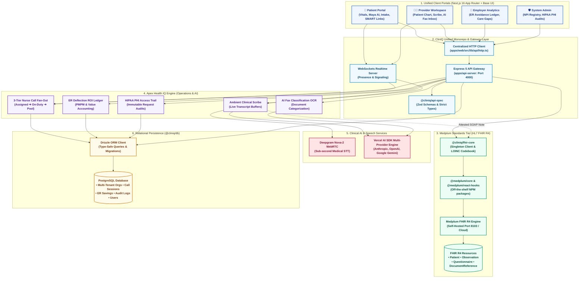
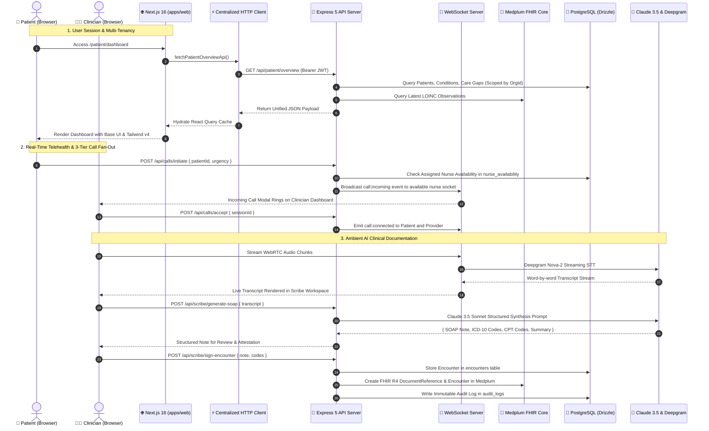
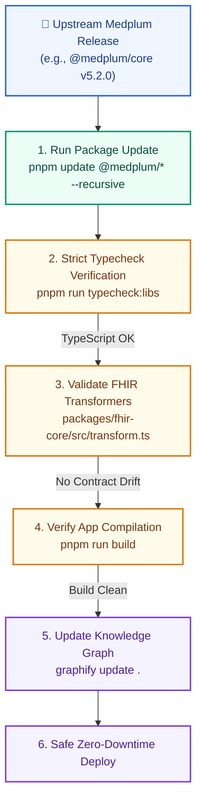
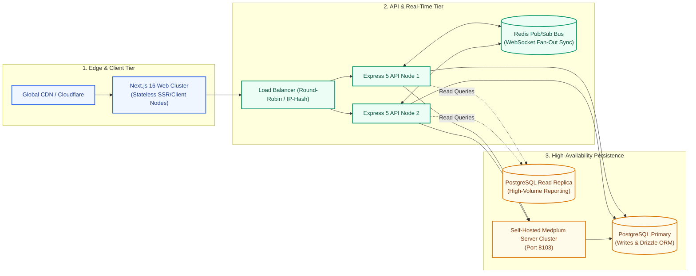

# System Architecture & Monorepo Topology

ClinIQ is an enterprise-grade virtual care and clinical intelligence platform built upon the **Decoupled Overlay Architecture**. It unifies three healthcare paradigms into a single, high-performance monorepo:

1. **Medplum (FHIR R4 Foundation & Standards Tier)**: Headless HL7 FHIR R4 data repository, SMART on FHIR authorization, standard LOINC biomarker codebook, and dynamic questionnaire engines.
2. **Apex Health IQ (Clinical AI & Operational Intelligence Engine)**: Ambient AI clinical scribe (Deepgram Nova-2 + Vercel AI SDK multi-provider engine with cascading fallback), 3-tier nurse fan-out call routing, AI inbound fax OCR & classification, B2B employer ER deflection savings ledger, and immutable HIPAA PHI audit logging.
3. **FooMedical (Patient Engagement & Digital Health Layer)**: Modern consumer patient portal, CMS/AHC HRSN social determinants screening, longitudinal vital trend visualizers, and SMART Health Links digital health passports.

---

## 1. High-Level System Architecture & Provenance Matrix

ClinIQ achieves zero vendor lock-in and seamless upstream upgradability by separating standards-based healthcare data (FHIR R4) from dynamic operational intelligence (PostgreSQL + Drizzle ORM).



---

## 2. Where Each Capability Comes From (Provenance Matrix)

ClinIQ intentionally combines battle-tested components from specialized healthcare domains:

| Subsystem / Feature | Source Heritage | Implementation in ClinIQ | Key Files & Modules |
| :--- | :--- | :--- | :--- |
| **HL7 FHIR R4 Engine** | **Medplum** | Standard FHIR R4 REST API, SMART on FHIR tokens, off-the-shelf SDKs. | `packages/fhir-core/src/client.ts`<br/>`packages/fhir-core/src/transform.ts` |
| **LOINC Biomarkers** | **Medplum / HL7** | Codified vital signs (BP, Pulse, SpO2, Blood Glucose, HbA1c, Lipids). | `packages/fhir-core/src/loinc.ts` |
| **FHIR Questionnaires** | **Medplum / FooMedical** | CMS AHC-HRSN screening, adult clinical intake questionnaires. | `packages/fhir-core/src/questionnaires.ts`<br/>`apps/web/src/app/patient/intake/` |
| **SMART Health Links** | **Medplum / SMART** | Cryptographic digital health passport & verifiable immunization cards. | `apps/web/src/app/patient/health-links/` |
| **Ambient AI Scribe** | **Apex Health IQ** | Real-time audio stream transcription, Vercel AI SDK SOAP generation & ICD-10 extraction with cascading fallback. | `apps/api-server/src/routes/scribe.ts`<br/>`apps/api-server/src/lib/ai/scribe.ts`<br/>`apps/web/src/app/provider/scribe/` |
| **3-Tier Nurse Routing** | **Apex Health IQ** | Smart cascade: Assigned primary nurse ➔ On-duty org nurses ➔ Org broadcast pool. | `apps/api-server/src/lib/callRouting.ts`<br/>`apps/api-server/src/routes/calls.ts`<br/>`packages/db/src/schema/index.ts` (`nurse_availability`) |
| **AI Digital Fax Inbox** | **Apex Health IQ** | Inbound document OCR, multi-class triage, patient MRN auto-matching. | `apps/api-server/src/routes/fax.ts`<br/>`apps/web/src/app/provider/fax/` |
| **ER Savings Ledger** | **Apex Health IQ** | Transactional B2B employer ER/Urgent Care deflection accounting & PMPM ROI. | `apps/api-server/src/routes/employer.ts`<br/>`packages/db/src/schema/index.ts` (`financial_event_ledger`) |
| **HIPAA PHI Audit Trail** | **Apex Health IQ** | Immutable logging of actor, IP, patient ID, resource type, and action. | `apps/api-server/src/lib/audit.ts`<br/>`packages/db/src/schema/index.ts` (`audit_logs`) |
| **Modern UI & Portals** | **ClinIQ Monorepo** | Next.js 16 App Router, Base UI primitives, Tailwind CSS v4, unified dark mode. | `apps/web/src/app/`<br/>`packages/ui/` |

---

## 3. End-to-End Runtime Architecture (How the Website Works)

ClinIQ operates as a synchronized distributed application with clear request boundaries and zero direct component-to-database leaks.



### Key Execution Highlights:
1. **Centralized HTTP Gateway**: Components never call `fetch()` directly. All requests pass through `src/lib/api/http.ts`, which injects JWT credentials, enforces tenant isolation headers, and unwraps typed responses.
2. **Dual-Path Data Resolution**:
   - **Clinical FHIR Path**: Standardized health records resolve via `@cliniq/fhir-core` and Medplum.
   - **Operational Relational Path**: High-throughput telemetry, nurse queues, and financial accounting resolve via `@cliniq/db` and Drizzle ORM.
3. **Bi-Directional Telephony**: Real-time nurse status heartbeats and call signaling run over WebSockets (`ws`), executing the 3-tier cascade in under 200ms.

---

## 4. Upstream Upgradability & Maintenance Runbook

A cornerstone of ClinIQ's architecture is **zero vendor lock-in** and **frictionless upstream updates**. Because Medplum packages are consumed as un-forked npm libraries and isolated inside `@cliniq/fhir-core`, you can upgrade Medplum versions without touching core business logic or risking git merge conflicts.



### Upstream Upgrade Procedure

#### 1. Upgrading Medplum Packages
To bump Medplum packages (`@medplum/core`, `@medplum/fhirtypes`, `@medplum/react-hooks`):
```bash
# Bump Medplum packages across workspace
pnpm update @medplum/core @medplum/fhirtypes @medplum/react-hooks --recursive

# Run strict TypeScript compiler across all packages
pnpm run typecheck
```

#### 2. Why Upgrades Never Break Business Logic
- **No Forked Medplum Code**: ClinIQ consumes `@medplum/*` exclusively via standard npm imports.
- **Isolating Adapters**: All FHIR type mappings and formatters live in `packages/fhir-core/src/transform.ts`. If Medplum adds or refines FHIR fields, updates are made in this single adapter file.
- **Relational Independence**: PostgreSQL operational tables (`packages/db/src/schema/index.ts`) operate completely independently of FHIR server versioning.

#### 3. Database Schema Evolutions (Drizzle ORM)
When extending operational models (e.g. adding new telehealth telemetry or employer billing fields):
```bash
# 1. Edit schema in packages/db/src/schema/index.ts
# 2. Push directly to development database
pnpm --filter @cliniq/db db:push

# 3. Or generate versioned migration SQL for production
pnpm --filter @cliniq/db db:generate
```

#### 4. Updating Clinical AI Models & Prompts
All LLM prompts for SOAP generation, ICD-10 extraction, and Fax OCR classification are centralized in `apps/api-server/src/lib/ai.ts`. Model upgrades (e.g. Claude 3.5 Sonnet to future iterations) are accomplished simply by updating the model parameter in `ai.ts` without modifying API contracts or UI components.

---

## 5. Scalability & Enterprise Deployment Blueprint

ClinIQ is engineered to scale horizontally across multi-region health systems and high-volume employer groups:



### Scalability Principles:
1. **Stateless API Tier**: Express 5 nodes store zero session state in-memory; authentication is verified via cryptographically signed JWTs.
2. **Distributed WebSockets via Redis Pub/Sub**: When scaling out API instances, nurse presence and incoming call broadcasts are synchronized across all nodes using Redis Pub/Sub.
3. **Database Connection Pooling**: Drizzle ORM utilizes connection pooling with PostgreSQL (compatible with PgBouncer or Neon Serverless scale-to-zero compute).
4. **Self-Hosted FHIR Clustering**: Medplum servers run in lightweight Docker containers behind standard load balancers, storing FHIR resources in dedicated partitioned tables.

---

## 6. Technology Stack Matrix

| Layer | Technology | Rationale & Responsibility |
| :--- | :--- | :--- |
| **Web Framework** | Next.js 16 (`next@16.3.3`) | App Router, React 19 Server/Client Components, Turbopack builds. |
| **UI Primitives** | Base UI (`@base-ui-components/react`) | Unstyled, accessible, zero-Radix DOM primitives for clinical workflows. |
| **Design System** | Tailwind CSS v4 (`@tailwindcss/postcss`) | CSS design tokens with specialized clinical Navy, Blue, Emerald, and Gold palette. |
| **Data Fetching** | TanStack React Query (`@tanstack/react-query`) | Automatic request deduplication, background caching, and optimistic mutations. |
| **API Server** | Express 5 & Node.js (`node@22`) | High-throughput REST API with native async error handling. |
| **Realtime Engine** | `ws` WebSocket Server | Sub-100ms nurse presence tracking, call signaling, and streaming audio buffers. |
| **Speech-to-Text** | Deepgram Nova-2 WebRTC | Sub-second medical terminology transcription. |
| **Clinical AI** | Anthropic Claude 3.5 Sonnet | Structured SOAP clinical synthesis, ICD-10 & CPT extraction, Fax OCR. |
| **Database & ORM** | PostgreSQL & Drizzle ORM | Type-safe, low-latency relational data management and migrations. |
| **FHIR Standard** | HL7 FHIR R4 & Medplum SDK | Standards-compliant healthcare data interoperability without cloud lock-in. |
| **Knowledge Graph**| Graphify AST Engine | Automated codebase topology indexing and dependency visualization. |

