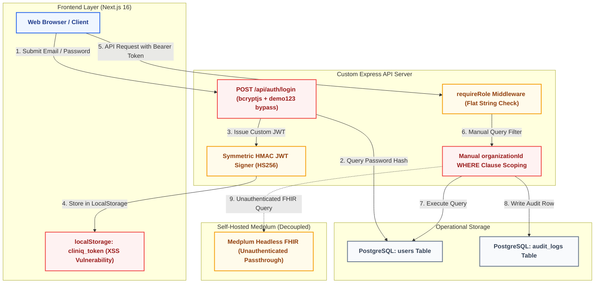
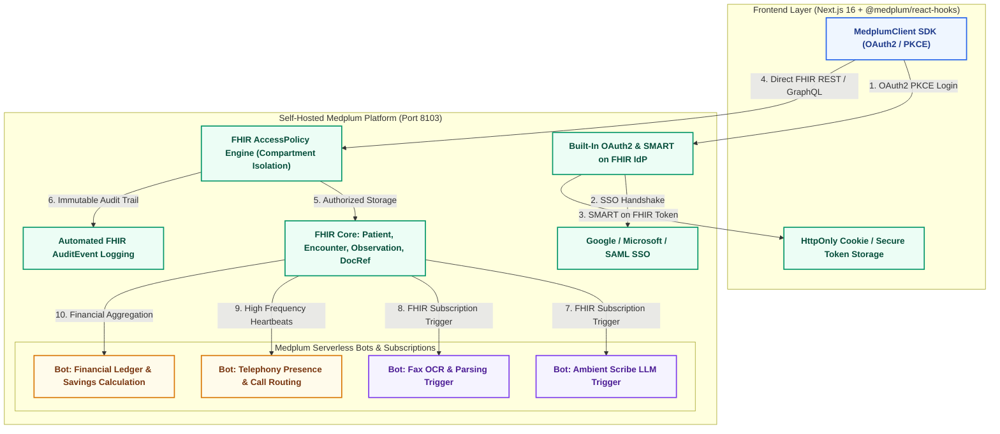
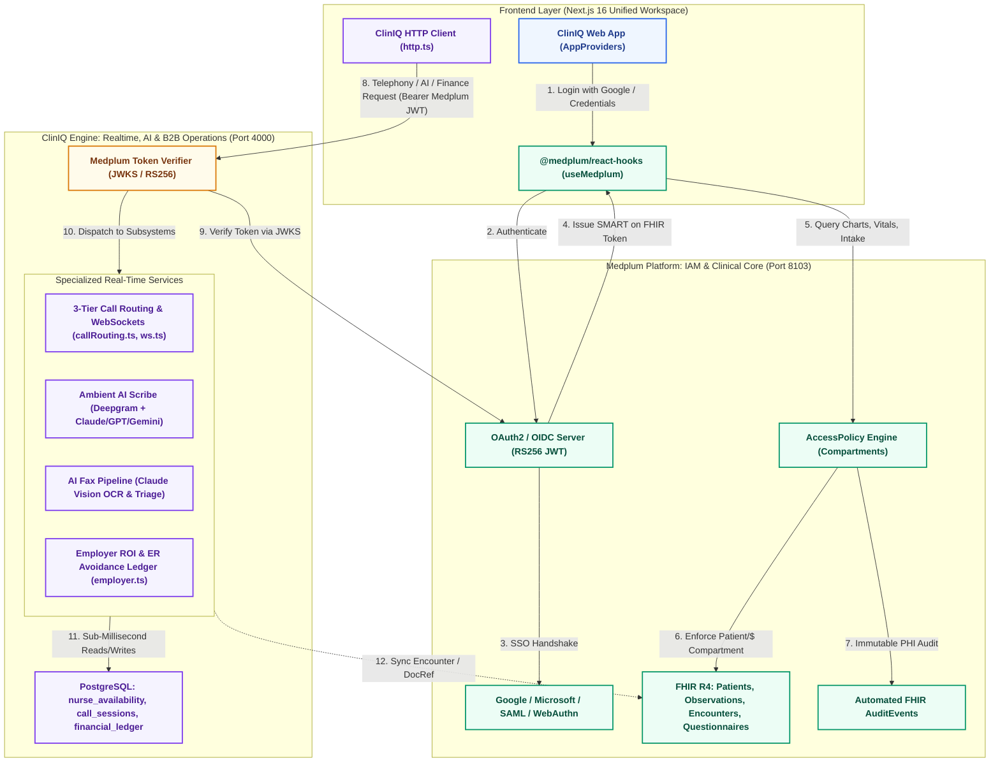

# Enterprise Authentication, Authorization & RBAC Architecture Options

This document provides an exhaustive, production-grade architectural analysis of **Authentication, Authorization, and Role-Based Access Control (RBAC)** for ClinIQ (Apex Health IQ) and its integration with **Medplum**. 

It evaluates three architectural paths across security, scalability, maintainability, compliance, and multi-tenancy to guide hospital-grade enterprise deployment.

---

## Executive Summary & Quick Comparison

```
┌──────────────────────────────────────────────────────────────────────────────────────────────────┐
│                                    ARCHITECTURAL PATH MATRIX                                     │
├───────────────────────┬───────────────────────────────┬──────────────────────────────────────────┤
│ Option                │ Architecture Strategy         │ Primary Verdict                          │
├───────────────────────┼───────────────────────────────┼──────────────────────────────────────────┤
│ Option 1: In-House    │ Custom Postgres Auth + JWT    │ 🔴 High Security Risk / High Maintenance │
│ Option 2: Pure FHIR   │ 100% Medplum Monolith         │ 🟡 Telephony & Sub-Tenancy Bottleneck    │
│ Option 3: Hybrid Core │ Medplum IAM + ClinIQ Overlay  │ 🟢 Recommended Enterprise Standard       │
└───────────────────────┴───────────────────────────────┴──────────────────────────────────────────┘
```

| Dimension | Option 1: Custom In-House Auth | Option 2: Pure Medplum Monolith | Option 3: Hybrid Architecture (Recommended) |
| :--- | :--- | :--- | :--- |
| **Identity Provider (IdP)** | Handcrafted in PostgreSQL (`users` table) | Medplum OAuth2 / OpenID Connect | Medplum OAuth2 / OpenID Connect |
| **Social & Enterprise SSO** | Manual custom OAuth integrations | Built-in Google, Microsoft, SAML, Okta | Built-in Google, Microsoft, SAML, Okta |
| **MFA / 2FA & Passkeys** | Must build from scratch (TOTP, WebAuthn) | Built-in WebAuthn / Passkeys & TOTP | Built-in WebAuthn / Passkeys & TOTP |
| **FHIR IDOR Protection** | Manual code checks on every endpoint | Enforced by FHIR `AccessPolicy` | Enforced by FHIR `AccessPolicy` |
| **Realtime Telephony & Scribe**| Native PostgreSQL & WebSockets (Fast) | High FHIR transformation latency | Native PostgreSQL & WebSockets (Fast) |
| **B2B Employer Sub-Tenancy** | Native dual-dimension database keys | Complex custom FHIR extension mapping | Native dual-dimension database keys |
| **Hospital CISO Audit Risk** | 🔴 High (Fails standard vendor review) | 🟢 Low (ONC/HIPAA Certified) | 🟢 Low (Medplum IAM + Scoped API) |
| **Maintainability Overhead** | 🔴 High (Continuous security patching) | 🟡 Medium (Complex FHIR Bots) | 🟢 Low (Clear separation of concerns) |
| **Overall Recommendation** | **Do Not Use in Production** | **Viable only for simple EHRs** | **Production & Hospital Ready** |

---

## Option 1: Custom In-House Authentication & Handcrafted RBAC

In this model, ClinIQ owns and operates its own identity store in PostgreSQL, signs symmetric HS256 JWTs in Node.js, and validates roles using Express route middleware.

### 1. Architectural Diagram



### 2. Breakdown of Capabilities

* **Authentication**: Managed via `users` table and `auth.ts`. Passwords verified using `bcryptjs`.
* **Authorization**: Express middleware (`requireRole`, `requireAdmin`) checks the decoded JWT `role` string.
* **Multi-Tenancy**: Manual SQL filtering on `organizationId` and `employerId` across all routes.
* **Audit Trail**: Manual insertion into `audit_logs` via `logPhiAccess`.

### 3. Detailed Evaluation

#### 🔴 Disadvantages & Severe Risks:
1. **Broken Object-Level Authorization (BOLA / IDOR)**: Because permission checks are manual in every endpoint handler, any missing `where(eq(table.patientId, user.patientId))` check exposes sensitive records across patients.
2. **XSS Token Extraction**: Storing tokens in `localStorage` fails standard hospital penetration testing.
3. **Hardcoded Fallbacks**: Demo credentials (`demo123`) in backend routes create severe backdoors if deployed to production.
4. **Maintenance Drain**: Engineering team must continuously build, test, and patch OAuth2 providers (Google, Microsoft, Okta), MFA, password resets, token rotation, and account lockouts.

#### 🟢 Advantages:
1. Complete flexibility over table schemas and user columns.
2. Sub-millisecond response times for pure relational queries.

---

## Option 2: 100% Pure Medplum Monolith Architecture

In this model, ClinIQ eliminates its PostgreSQL database and Express API server entirely, routing **all** data, user management, call states, faxes, and financial ledgers into standard FHIR R4 resources and Medplum Bots/Subscriptions.

### 1. Architectural Diagram



### 2. Breakdown of Capabilities

* **Authentication**: 100% native Medplum OAuth2 / OIDC with Google, Microsoft, Passkeys, and MFA.
* **Authorization**: Enforced entirely by Medplum `AccessPolicy` resources. Compartment isolation (`Patient/$`) guarantees zero cross-patient data leakage.
* **Multi-Tenancy**: Medplum `Project` isolation.
* **Compliance**: Automatic ONC-compliant `AuditEvent` creation for every HTTP read/write.

### 3. Detailed Evaluation

#### 🟢 Advantages:
1. **Gold-Standard Security**: Zero custom auth code; hardened by years of production use in clinical systems.
2. **Built-in Enterprise SSO**: Instant support for Google, Microsoft, and hospital SAML/Okta credentials.
3. **Ironclad IDOR Protection**: Compartments prevent any user from accessing data outside their authorized scope.

#### 🔴 Disadvantages & Architectural Impedance Mismatches:
1. **Telephony & Realtime Bottleneck**: Managing sub-second nurse presence heartbeats (e.g. 5-second polling across hundreds of active nurses) through FHIR JSON resources creates massive database write amplification.
2. **Lack of B2B Employer Sub-Tenancy**: Medplum's project model is 1-dimensional (Project $\rightarrow$ User). It lacks native support for 2-tier corporate health plans where HR admins need aggregate, de-identified ER savings metrics without PHI.
3. **Complex Bot Workflows**: Implementing multi-LLM cascading fallbacks and WebRTC signaling inside Medplum Bots is significantly harder to test, monitor, and debug than standard Node.js services.

---

## Option 3: Unified Enterprise Hybrid Architecture (RECOMMENDED)

This is the industry-standard architecture used by top digital health platforms. It assigns **Identity, Authentication, and Clinical Records** to Medplum, while assigning **Real-Time Telephony, Ambient AI, Fax OCR, and B2B Financial Ledgers** to the ClinIQ Express/Postgres operational engine.

### 1. Architectural Diagram



---

## Comprehensive Trade-Off & Feature Matrix

| Evaluation Criteria | Option 1: In-House Custom Auth | Option 2: Pure Medplum Monolith | Option 3: Hybrid Architecture (Recommended) |
| :--- | :--- | :--- | :--- |
| **Authentication Engine** | Custom bcrypt + custom JWT | Medplum OAuth2 / OpenID Connect | Medplum OAuth2 / OpenID Connect |
| **Enterprise SSO (Google/MS/Okta)**| ❌ Requires manual implementation | ✅ Built-in out of the box | ✅ Built-in out of the box |
| **MFA, Passkeys & WebAuthn** | ❌ Requires manual implementation | ✅ Built-in out of the box | ✅ Built-in out of the box |
| **IDOR / BOLA Prevention** | ❌ Manual code checks per route | ✅ Enforced by `AccessPolicy` | ✅ Enforced by `AccessPolicy` |
| **HIPAA Compliance Readiness** | ⚠️ High liability, uncertified code | ✅ ONC & HIPAA Certified | ✅ ONC/HIPAA Certified IAM & FHIR Core |
| **Realtime Telephony Latency** | ⚡ < 5ms (In-memory WebSockets) | 🐢 > 150ms (FHIR polling/subscriptions)| ⚡ < 5ms (Postgres + Redis + WS) |
| **Ambient AI Scribe Pipeline** | ⚡ Native streaming & fallbacks | ⚠️ Complex inside FHIR Bots | ⚡ Native streaming & fallbacks |
| **B2B Employer Sub-Tenancy** | ✅ Native dual-dimension keys | ❌ Not supported in flat FHIR | ✅ Native dual-dimension keys |
| **Developer Maintenance Burden**| 🔴 Extreme (Continuous security fixes)| 🟡 Medium (Complex FHIR mappings) | 🟢 Low (Clean separation of concerns) |
| **Hospital IT Security Approval**| 🔴 Fails enterprise CISO review | 🟢 Fast approval | 🟢 Fast approval |

---

## In-Depth Analysis: Scalability, Maintainability & Security

### 1. Scalability Analysis
* **Option 1**: Fast for basic queries, but scales poorly as enterprise security requirements (MFA, token rotation, session invalidation across servers) are added.
* **Option 2**: Hits database write bottlenecks when handling high-frequency operational telemetry (WebRTC signaling, nurse heartbeats, inbound audio streaming).
* **Option 3**: **Optimal Scalability**. Heavy clinical reads and writes are offloaded to Medplum's optimized FHIR store, while high-concurrency WebSockets, audio streams, and financial ledgers run on lightweight Express/Redis/Postgres instances.

### 2. Maintainability & Code Hygiene
* **Option 1**: Technical debt accumulates rapidly. Any bug in the custom auth middleware can expose the entire health system to data leaks.
* **Option 2**: Heavy technical debt from shoehorning non-clinical business logic (employer cost avoidance formulas, telephony queues) into FHIR extensions.
* **Option 3**: **Optimal Maintainability**. `@medplum/core` is used as a standard library that can be upgraded with standard `npm update` commands with zero merge conflicts or schema breaks.

### 3. Security Posture & Compliance
* **Option 1**: Vulnerable to BOLA/IDOR, hardcoded backdoor credentials, and XSS token extraction.
* **Option 2 & 3**: Eliminate custom credential storage. Leverage Medplum's cryptographically verified SMART-on-FHIR tokens, standard asymmetric key signing (RS256), and compartment-based access policies.

---

## Implementation Blueprint for Option 3 (The Recommended Path)

### 1. Frontend: Medplum Authentication Provider
In `apps/web/src/app/(auth)/signin/page.tsx`, initialize authentication using the official Medplum SDK:

```typescript
import { useMedplum } from "@medplum/react-hooks";

export default function SignInPage() {
  const medplum = useMedplum();

  // Standard Email / Password via Medplum IdP
  const handleLogin = async (email: string, pass: string) => {
    const loginResult = await medplum.signInWithCredentials(email, pass);
    // MedplumClient automatically manages tokens in memory/cookies
  };

  // 1-Click Enterprise SSO (Google, Microsoft, SAML)
  const handleGoogleLogin = () => {
    medplum.signInWithRedirect("google");
  };
}
```

### 2. Backend: Medplum Token Verification Middleware
In `apps/api-server/src/middleware/auth.ts`, replace custom JWT parsing with Medplum token verification:

```typescript
import { Request, Response, NextFunction } from "express";
import { MedplumClient } from "@medplum/core";

const medplum = new MedplumClient({
  baseUrl: process.env.MEDPLUM_BASE_URL || "http://localhost:8103/",
});

export async function authMiddleware(req: Request, res: Response, next: NextFunction) {
  const authHeader = req.headers.authorization;
  if (!authHeader?.startsWith("Bearer ")) {
    res.status(401).json({ error: "Missing or invalid authorization header" });
    return;
  }

  const token = authHeader.split(" ")[1];

  try {
    // Validate the token against the self-hosted Medplum instance
    const client = new MedplumClient({
      baseUrl: medplum.getBaseUrl(),
      accessToken: token,
    });

    // Fetches Practitioner or Patient resource corresponding to this token
    const profile = await client.getProfile();

    req.user = {
      userId: profile.id!,
      role: profile.resourceType === "Practitioner" ? "physician" : "patient",
      organizationId: profile.meta?.project || "",
      patientId: profile.resourceType === "Patient" ? profile.id : undefined,
      providerId: profile.resourceType === "Practitioner" ? profile.id : undefined,
    };

    next();
  } catch (err) {
    res.status(401).json({ error: "Invalid or expired Medplum session" });
  }
}
```

### 3. Medplum AccessPolicy Specifications

Define 4 declarative access policies in Medplum:

```json
{
  "resourceType": "AccessPolicy",
  "name": "Patient Self-Service Access Policy",
  "compartment": {
    "reference": "Patient/%patient.id"
  },
  "resource": [
    {
      "resourceType": "Patient",
      "readonly": true
    },
    {
      "resourceType": "Observation",
      "readonly": true
    },
    {
      "resourceType": "QuestionnaireResponse",
      "writeFields": ["*"]
    }
  ]
}
```

```json
{
  "resourceType": "AccessPolicy",
  "name": "Clinical Staff (Nurse / Physician) Policy",
  "resource": [
    {
      "resourceType": "Patient",
      "criteria": "Patient?_project=%project.id"
    },
    {
      "resourceType": "Observation",
      "criteria": "Observation?_project=%project.id"
    },
    {
      "resourceType": "Encounter",
      "criteria": "Encounter?_project=%project.id"
    },
    {
      "resourceType": "DocumentReference",
      "criteria": "DocumentReference?_project=%project.id"
    }
  ]
}
```

---

## Final Recommendation

For **ClinIQ (Apex Health IQ)** to transition from a prototype to a **hospital-ready, enterprise-grade healthcare product**, **Option 3 (Hybrid Architecture)** is the only viable long-term architecture. 

It eliminates fragile custom authentication and compliance vulnerabilities by delegating identity and FHIR access control to Medplum, while preserving the high-speed real-time telephony, ambient AI, and financial ROI intelligence that make ClinIQ uniquely valuable.
